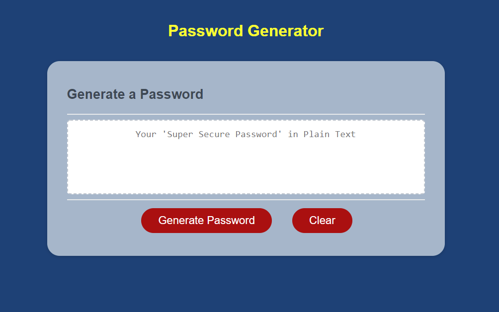

# Module 3 Challenge - Password Generator

This application is a random password generator. The user will choose the parameters of their password (length, character type sets), and a password will be generated of the specified character length, with a random string of characters, and displayed in the text area. Input validation will require the user to enter at least one character type.

A 'Clear' button was added as an extra feature, which will allow a user to reset the textarea field. 

## Example of Web Application Interface

